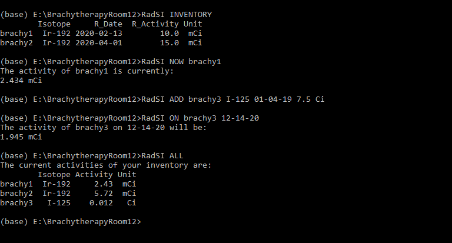

# RadSI - The Radiation Source Inventory

RadSI is a simple command-line interface (CLI) method of tracking the activities in your inventory of radioactive sources. You can add sources to your inventory and find out the current activity, activity at a specified date, or when the source will reach a specified activity. 

## Motivation 
As is often the case, each source in a lab or hospital setting gets some sort of binder or massive chart that contains pages of look up tables. To get the activity of a specific source, one has to find the assocaited binder or the chart and search through until the right cell is found that gives you the activity of your source at a specific time.

If you add a new source to your inventory, you have to make a new binder. If you don't have the time you need in the look up table, you have to do some manual interpolation or full calculation to get what you need. You could use spreadsheet software, but that comes with its own inconveniences. These methods are useful, but very limited. 

RadSI provides a more automated approach, in which you simply enter the source in your logged inventory and your activity is calculated - down to second if need be! A range of commands are available, to quickly give you the information you need in regard to your radioactive sources. 

## Quick Install/Initialization From Scratch (No Python on your computer)
While there are ultimately many ways to go from no Python to using RadSI, here is how I would do it. (If you have Anaconda already, skip step 1. If you have Python, and do not want to use the Anaconda Prompt, skip step 1 & 2, use the terminal of your choice making sure your path/activation/etc... conditions are met)

1. Download the latest version of [Anaconda](https://www.anaconda.com/products/individual). This is an open source Python distribution, that comes with many of the packages you need. No need to use a terminal for this step, follow the link for install wizard options.
2. Find and open the Anaconda Prompt. You can do this through the Anaconda Navigator, start menu, or by searching on your computer. 
3. Type (or copy & paste) the following into Anaconda Prompt. This downloads an additional package you need, that does not come with Anaconda.

        pip install fire
        
4. Now type (or copy & paste) the following into the Anaconda Prompt. This downloads RadSI.

        pip install RadSI
        
5. Change your directory to where you want to store your inventory (in other words, navigate to the "folder" you want to use). This can be done by typing "cd" and then the path. 
6. Type the following command to initialize. 

        RadSI INITIALIZE

This should return a welcome message. This will also create two CSV files and place them in your current directory: inventory.csv and halflife.csv. The former acts as your radiation source inventory, containing your sources names, isotope, reference date, reference activity, and activity units. The latter is a library of isotopes and their corresponding half-lives in seconds to be used for calculations. Both can be manipulated directly, but it is recommended to manipulate them via the RadSI CLI to insure proper formatting. When using RadSI, make sure you are in the directory that you INITIALIZE'd in so that RadSI can pull the inventory and library. To use multiple inventories (say for different labs or treatment rooms), simply initialize in separate folders.

### Dependencies
The following packages are required, but don't worry about it if you've followed the steps above:
- setuptools
- pandas
- numpy
- matplotlib
- fire

## Documentation 

### Commands:
To use a command, simply type 

        RadSI COMMAND Parameters 
        
into your python terminal. For example:

        RadSI NOW calibration1
        
Will print the current activity of the source named 'calibration1' in your Inventory. Below is a list of available commands. If you are using Anaconda, open up the Anaconda Prompt.

INITIALIZE - this command must be executed first! It initializes two .csv files in your current directory:
1. inventory.csv- this is your radiation source inventory. Though blank at first, it can be manipulated with ADD and DELETE
2. halflife.csv - this is your half-life library, with units of seconds. It comes prebuild with isotopes, but additional isotopes can be added with LIBARARY_ADD

INVENTORY - this simply prints the current inventory

LIBRARY - this simpy prints out the current half-life library

ADD - This adds a source to the inventory and updates inventory.csv. The parameters are:  
- name        - this is the "nick name" of your specific source (Ex: medical1)  
- Isotope     - this is the isotope of your source, written as the element’s initials dash mass number (Ex: Co-60)  
- R_Date      - this is the datetime at which your referenced activity was determined, written as month-day-year-hour:minute:second though not all timing info is needed. (Ex: 12-7-2019-12:30:00)  
- R_Activity  - this is the activity of your source at the referenced date time (Ex: 30)  
- Unit        - this is the units of activity for your source (Ex: mCi)  

LIBRARY_ADD - This adds a isotope to the half-life library and updates halflife.csv. The Parameters are:
- Isotope     - this is the isotope to be added, written as the element’s initials dash mass number (Ex: Co-60)
- halflife    - this is the half-life in seconds
        
DELETE - This deletes a source from the inventory and updates invetory.csv. The parameter is:
- name       - this is the "nick name" of your specific source (Ex: medical1)  
        
NOW - This calculates the current activity of the specified source. The parameter is:
- name       - this is the "nick name" of your specific source (Ex: medical1)  
- round_to   - this an optional parameter that tells Rad_SI how many decimals to include. The default is 3.
        
ON - This calculates the activity of the specified source on a specified datetime. The parameters are:
- name       - this is the "nick name" of your specific source (Ex: medical1) 
- date       - this is the datetime at which you wish to calculate the activity of the specified source, written as month-day-year-hour:minute:second though not all timing info is needed. (Ex: 12-7-2019-12:30:00) 
- round_to   - this an optional parameter that tells Rad_SI how many decimals to include. The default is 3.

WHEN - This calculates when a specified source will reach a specified activity. The parameters are:
- name       - this is the "nick name" of your specific source (Ex: medical1) 
- activity    - this is the activity for which the datetime is to be solved fore
- units      - these are the units of the activity
        
PLOT - This allows the activity of a specified source to be plotted against time from the referenced datetime of that source
- name       - this is the "nick name" of your specific source (Ex: medical1)
- date       - this is the upper bound of the time plotted (Ex: 12-7-2019-12:30:00), written as month-day-year-hour:minute:second though not all timing info is needed. If left blank, the time is taken as now  

LOGPLOT - This allows the log of the activity of a specified source to be plotted against time from the referenced datetime of that source
- name       - this is the "nick name" of your specific sourc (Ex: medical1)
- date       - this is the upper bound of the time plotted (Ex: 12-7-2019-12:30:00), written as month-day-year-hour:minute:second though not all timing info is needed. If left blank, the time is taken as now  

HELP- This simply prints a condensed version of this documentation 

#### A note on date and time

To handle time based calculations, dates and times are entered as month-day-year-hour:minute:second, though not all timing info is needed. The time portion is a 24 hour clock, making midnight and noon 00:00:00 and 12:00:00 respectively. If no time is specified, midnight is assumed. If no day is specified, the first of the month is assumed. The format is somewhat robust, the following would all represent when the ball dropped in NYC on New Year's Day in 1999:

        01-01-1999:00:00:00   01-01-1999:00:00   01-01-1999:00   01-01-1999   01-01-99   1-1-99   1-99
 
The following would all represent the [time President Obama was born](https://obamawhitehouse.archives.gov/blog/2011/04/27/president-obamas-long-form-birth-certificate):

        08-04-1961-19:24:00   08-04-1961-19:24   08-04-61-19:24  8-4-61-19:24
        
For isotopes or calculations in which time on the order of hours are relevant, care should be taken to input the reference date in the time zone your "NOW" or "ON" calculations are being performed. 

#### Allowed activity units

The allowed units of activity are kCi, Ci, mCi, uCi (microcurie), nCi, TBq, GBq, MBq, kBq, Bq. When appropriate, units will automatically be adjusted so that instead of 1E-6 Ci being displayed, 1 uCi is. 

## Feedback
If you use RadSI, I'd very much appreciate your feedback. Feel free to do so via github, or by emailing me at mdurbin@psu.edu.

#### Acknowledgements 
Thank you to Josh Gallagher and Josh Flygare for their helpful feedback so far. Additional thanks to Ryan Sheatsley for, with out knowing it, becoming a compsci mentor of sorts!
