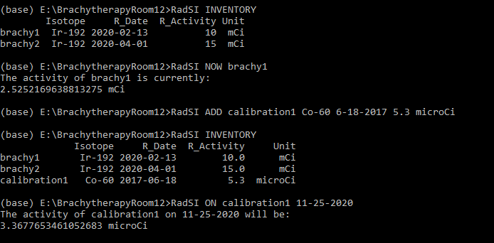

# RadSI - The Radiation Source Inventory

RadSI is a simple CLI method of tracking the activities in your inventory of radioactive sources.

## Motivation 
As is often the case, each source in a lab or hospital setting gets some sort of binder or massive chart that contains pages of look up tables. Thus to get the activity of a specific source, one has to find the binder or the chart and search through untill you find the right cell that gives you the activity of your source at a specific time.

If you add a new source to your inventory, you have to make a new binder. If you don't have the time you need in the look up table, you have to do some manual interpolation of full calculation to get what you need. You could use spreadsheet software, but that comes with it's own inconveniences. 

RadSI provides a more automated approach, in which you simply enter the source in your logged inventory and your activity is calculated - down to second if need be!

## Quick Documentation 
In addition to RadSI.py, there are two important documents:

inventory.csv - This file is your inventory of radiation sources. It can be edited directly, or through the command ADD and DELETE. It contains the following columns:  
- index       - this is the "nick name" of your specific sourc (Ex: medical1)  
- Isotope     - this is the isotope of your source, written as the elements initals dash mass number (Ex: Co-60)  
- R_Date      - this is the datetime at which your referenced activity was determined, written as day-month-year-hour:minute:second though not all timing info is needed.   (Ex: 12-7-2019-12:30:00)  
- R_Activity  - this is the activity of your source at the referenced date time (Ex: 30)  
- Unit        - this is the units of activity for your source (Ex: mCi) 
        
                
halflife.csv - This file is the library of isotopes and their halflifes in seconds. It can be edited directly. 

### Dependencies
The following pacakges are required:
- setuptools
- pandas
- numpy
- matplotlib
- fire

### Instilation:
This CLI is run direcly form a terminal. [Anaconda](https://www.anaconda.com/products/individual) offers a great distibution of python, IDEs, many packages, and the Anaconda Prompt. It also comes with most of the packages you need, with the exception of Fire.
With [pip3](https://pip.pypa.io/en/stable/) installed, RadSI should be abled to be downloaded by simply entering

        pip3 install RadSI

or 

        pip install -i https://test.pypi.org/simple/ RadSI==1.0.6

Your Inventory will be stored in the current working directory upon the nessesary use of the "INITIALIZE" command.
To access a inventory, make sure you are in the directory that you "INITIALIZE"-d in.

If you need to add a package from the Dependencies section, and you have pip, you can do so as follows:

        pip install package

### Commands:
To use a command, simplytype RadSI{space}COMMAND{space}Parameters into your python terminal 

INITIALIZE - this command must be executed first! It initializes two .csv files in your current directory:
        inventory.csv- this is your radiation source inventory. Though blank at first, it can be maniuplated with ADD and DELETE
        halflife.csv - this is your halflife library, with units of seconds. It comes prebuild with isotopes, but additional isotopes can be added with LIBARARY_ADD

INVENTORY - this simply prints the current inventory

LIBRARY - this simpy prints out the current halflife library

ADD - This adds a source to the inventory and updates inventory.csv. The paramaters are:  
- name        - this is the "nick name" of your specific sourc (Ex: medical1)  
- Isotope     - this is the isotope of your source, written as the elements initals dash mass number (Ex: Co-60)  
- R_Date      - this is the datetime at which your referenced activity was determined, written as day-month-year-hour:minute:second though not all timing info is needed. (Ex: 12-7-2019-12:30:00)  
- R_Activity  - this is the activity of your source at the referenced date time (Ex: 30)  
- Unit        - this is the units of activity for your source (Ex: mCi)  

LIBRARY_ADD - This adds a isotope tot he halflife library and updates halflife.csv. The Parameters are:
- Isotope     - this is the isotope to be added, written as the elements initals dash mass number (Ex: Co-60)
- halflife    - this is the halflife in seconds
        
DELETE - This deletes a source from the inventory and updates invetory.csv. The parameter is:
- name       - this is the "nick name" of your specific sourc (Ex: medical1)  
        
NOW - This calculates the current activity of the specified source. The paramter is:
- name       - this is the "nick name" of your specific sourc (Ex: medical1)  
        
ON - This calculates the activity of the specified source on a specified datetime. The parameters are:
- name       - this is the "nick name" of your specific sourc (Ex: medical1) 
- date       - this is the datetime at which you wish to calculate the activity of the specified source (Ex: 12-7-2019-12:30:00)  
        
PLOT - This allows the activity of a specified source to be plotted agaisnt time from the referenced datetime of that source
- name       - this is the "nick name" of your specific sourc (Ex: medical1)
- date       - this is the upperbound of the time plotted (Ex: 12-7-2019-12:30:00). If left blank, the time is taken as now  

HELP- This simply prints a condensed version of this documentation 
